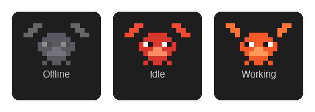
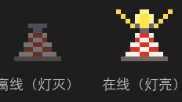
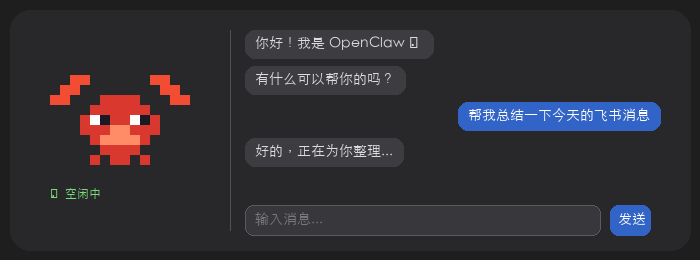

# Claw Notch

将 [OpenClaw](https://github.com/nicepkg/openclaw) AI 助手集成到 macOS 灵动岛（Dynamic Island）中。

> 本项目基于 [boring.notch](https://github.com/TheBoredTeam/boring.notch) 修改开发，感谢 TheBoredTeam 的开源项目。

## 功能特性

- **像素风小龙虾** — 收起和展开灵动岛中都有像素画龙虾，3 种状态（离线灰色 / 空闲彩色 / 工作中动画）
- **像素风灯塔** — 显示 OpenClaw 连接状态，在线时灯亮并发出光芒，离线时灯灭
- **WebSocket 实时通信** — 连接 OpenClaw Gateway，实时监听 agent 事件（飞书、Discord 等外部消息自动触发龙虾动画）
- **消息同步 Dashboard** — 通过 WebSocket `chat.send` 发送消息，与 OpenClaw Dashboard 完全同步
- **展开灵动岛对话** — 左侧大像素龙虾状态图标，右侧聊天气泡界面（最近 5 条消息，支持快速输入）
- **消息历史持久化** — 重启应用后保留最近 50 条消息
- **标签页排序** — 可自定义灵动岛标签页顺序，将 OpenClaw 设为默认首页
- **一键打开 Dashboard** — 灵动岛内按钮直接拉起 OpenClaw Dashboard

## 截图

### 小龙虾三种状态（灵动岛收起时）

像素风小龙虾有 3 种状态：**离线**（灰色）、**空闲**（彩色静止）、**工作中**（彩色挥钳动画）。



### 灯塔连接指示（灵动岛收起时）

像素风灯塔显示 OpenClaw 连接状态：**离线**（灯灭）、**在线**（灯亮发光）。



### 展开灵动岛

左侧：大像素龙虾显示当前活动状态。右侧：聊天气泡 + 快速输入框 + 打开 Dashboard 按钮。



## 环境要求

- macOS 14.0+（需要 MacBook Pro 带刘海/灵动岛的机型）
- Xcode 15.0+（仅从源码编译时需要）
- [OpenClaw](https://github.com/nicepkg/openclaw) 本地部署并运行

## 安装

### 方式一：从源码编译（推荐）

```bash
# 1. 克隆项目
git clone https://github.com/uler0002791-eng/claw-notch.git
cd claw-notch

# 2. 用 Xcode 打开并编译
open boringNotch.xcodeproj
# 在 Xcode 中选择 Product → Run (⌘R)
```

### 方式二：下载预编译版本

前往 [Releases](https://github.com/uler0002791-eng/claw-notch/releases) 页面下载最新的 `.dmg` 文件，拖入 Applications 文件夹即可。

> 首次打开可能提示"无法验证开发者"，请在 **系统设置 → 隐私与安全性** 中点击"仍要打开"。

## 配置

### 1. 启动 OpenClaw

确保 OpenClaw Gateway 已在本地运行（默认地址 `127.0.0.1:18789`）：

```bash
openclaw start
```

### 2. 配置连接

打开灵动岛 → **Settings → OpenClaw**：

- **Gateway URL** — OpenClaw Gateway 地址（默认 `ws://127.0.0.1:18789`）
- **API Token** — OpenClaw 的认证 Token
- **启用龙虾标签页** — 开关 OpenClaw 功能

### 3. 自定义标签页顺序

打开 **Settings → General → Tab Order**，拖拽调整标签页顺序。将 OpenClaw 拖到第一位，展开灵动岛时默认显示对话页面。

## 使用

- **查看状态** — 灵动岛收起时，龙虾和灯塔实时显示 OpenClaw 连接状态
- **快速对话** — 展开灵动岛，在输入框中输入消息，按回车发送
- **查看历史** — 展开灵动岛后可查看最近的对话记录（包括飞书、Dashboard 发送的消息）
- **打开 Dashboard** — 点击对话区域下方的 Dashboard 按钮，直接打开 OpenClaw 管理面板
- **清除历史** — 点击对话区域右上角的清除按钮

## 致谢

- [boring.notch](https://github.com/TheBoredTeam/boring.notch) — 本项目基于此开源项目修改开发
- [OpenClaw](https://github.com/nicepkg/openclaw) — AI 助手引擎
